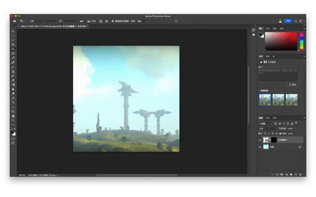

我想要幫部落格做一張背景圖，類似遊戲「地平線：期待黎明」的人機共生科幻風格，最好有「薩爾達傳說：曠野之息」薄霧覆蓋的大片綠意，畫面呈現人類、科技與大自然和諧共存的概念。
<!--more-->



只是這樣的圖片，從現有的 Pixbay, Unsplash 圖庫網站遲遲找不到適合的，或者說，適合的可能要課金才有更多選擇。「不如自己做一張吧！」既然有免費的 AI 繪圖網站 DALL.E 還有 Photoshop 新推出的生成填色功能，就來試玩看看?

## 先上圖看結果

用 Photoshop 把 1024 x 1024 的 1:1 原圖，延伸做成 1920 x 967 的延伸背景圖。

## 流程步驟

### 1. 跟 ChatGPT 聊聊想要的圖片方向 {.wp-block-heading}

我先想到的是「清爽自然的科技風格背景」，請 ChatGPT 加強描述

它提供的是：

<blockquote class="wp-block-quote">
  

    一幅清爽且自然的科技風格背景圖，其中融入了現代科技元素與自然環境的和諧共存。圖中的科技元素以簡潔的線條和幾何形狀呈現，並與周圍的自然環境融為一體。背景色調以清新的綠色和藍色為主，營造出一種清爽舒適的感覺。這張圖片將非常適合用於部落格的背景或者插圖。
  

</blockquote>

在跟 ChatGPT 一番討論來回後，我才突然想到，之前玩「地平線：期待黎明」時，很喜歡它的遊戲畫面，回想那時候在翠綠廣闊的草原上，成功用弓射倒機械獸，心情真是很激動啊！

我直接請 ChatGPT 根據我這段話翻譯成英文，怕他不懂我講的地平線是遊戲，我還貼心先找遊戲原文名稱給它：

<blockquote class="wp-block-quote">
  

    未來感的大自然風景，有大片藍天和部分綠地，未來科技與自然環境和諧共存，類似 Horizon Zero Dawn 的遊戲畫面
  

</blockquote>

它回覆：
> A futuristic natural landscape with large expanses of blue sky and some greenery, where future technology and the natural environment coexist harmoniously, similar to the game visuals of Horizon Zero Dawn.</em>

就是這句了！

### 2. 在 DALL.E 下 prompt 生成圖片

DALL.E 可以根據提供的描述免費生成圖片，類似平台更知名的是 Midjourney，但因為它已經取消免費使用，每個月收費 8 美金，以我目前的需求來說可以先不考慮。

DALL.E 每月有 14 點額度可以使用，每出一次圖會扣除 1 點。每次出圖會提供 4 張圖片讓你挑選。你可以多多嘗試不同的描述，看看哪一種最符合你的需求。

基本上生成圖片就是不斷在第一、二步驟來回嘗試：

  1. 發想並請 ChatGPT 給 Prompt
  2. 請 DALL.E 出圖

最後才在額度用盡前，勉強找到一張跟想像中相對接近的圖片，雖然還少了我期待的機械生物或無人飛行器，但清爽的色調讓人看得心情愉悅，就可以進到下一步延伸尺寸。

### 3. 以 Photoshop 指定圖片尺寸並延伸圖片背景 {.wp-block-heading}

從 DALL.E 產出的圖是 1024 x 1024 ，但我需要的橫幅 Banner 尺寸是 1920 x 967，不只比例不一樣，還需要延伸背景。<figure class="wp-block-image size-large">

其實 DALL.E 原本就有內建延伸背景這個方便的功能，有機會在 DALLE 一起做掉，但在第二個步驟，我為了產出期待的圖片已經把額度用完了?

還好，Photoshop 在上個月新推出的 AI 功能「生成填色」，可以讓我們指定圖片的尺寸，並延伸原始圖片的背景，甚至無中生有。許多網友把[各種迷因還原「真相」或做成專輯封面][1]，非常有趣！

雖然一次只出 3 張圖，但比起 DALL.E 的好處是可以指定尺寸，而且目前用起來沒有被限制出圖的次數，很佛心！

可以到[官方頁面][2]下載桌面版的 Photoshop (Beta)。

在這個步驟，我們只需要用到兩個功能：裁切工具和生成填色。

  1. 先用「裁切工具」延伸我需要的尺寸
  2. 再選取我需要 AI 延伸的背景，點選「生成填色」

值得注意的是，生成填色如果希望延伸既有的圖片背景，Prompt 只要維持空白就好，除非希望無中生有幫圖片加料，才需要另外寫關鍵字。

想試試科幻風格的可愛動物，出現了疑似杯麵家族的機械獸？

只要多多嘗試不同關鍵字，或不輸入關鍵字，最後選擇順眼的圖片，就可以打完收工啦。

希望這篇教學文能幫助到想自己嘗試用 AI 畫圖，又需要指定尺寸的朋友?

## 3 招輕鬆學

今天跟你分享：

  1. 沒靈感時，可以跟 ChatGPT 討論想要的圖片方向
  2. 可以善用 DALL.E 的每月免費額度產出圖片
  3. 想延伸圖片背景、指定尺寸、無中生有，可以試試 Photoshop (Beta)

## 延伸閱讀 

  * [利用 DALL.E 繪圖工具像 Photoshop AI 一樣自動生成延伸圖片內容 (playpcesor.com)][3]
  * [透過「生成填色」體驗 Photoshop 的未來 (adobe.com)][2]

 [1]: https://tech.udn.com/tech/story/123158/7205037
 [2]: https://helpx.adobe.com/tw/photoshop/using/generative-fill.html
 [3]: https://www.playpcesor.com/2023/05/dalle-photoshop-ai.html