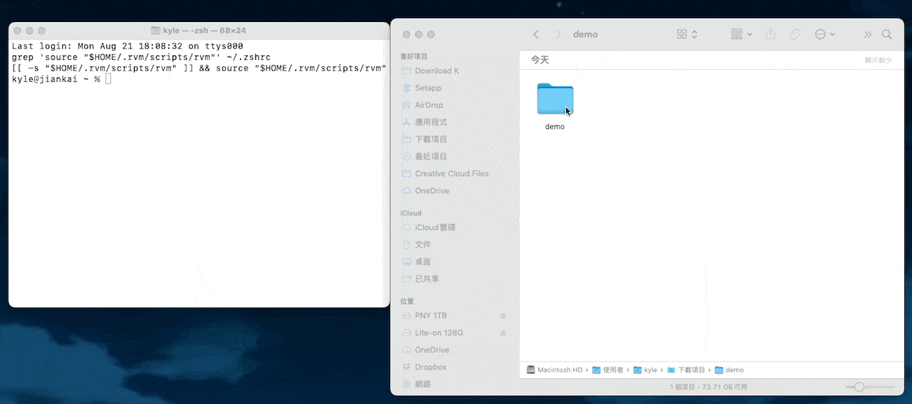

練習在 iOS APP 串接 Google maps，學習安裝 Google Maps for iOS SDK
<!--more-->




## 作品目的 {.wp-block-heading}

練習在 iOS APP 串接 Google maps。


## 學習目標 {.wp-block-heading}

  * 因應 M1 環境更新 Ruby 版本
  * 安裝 cocoapods
  * 設定 Google Maps for iOS

<div style="height:30px" aria-hidden="true" class="wp-block-spacer">
</div>

## 設定流程 {.wp-block-heading}

  1. **安裝 CocoaPods 於 M1 MacBook** 
      * 安裝Homebrew
      * 使用Homebrew安裝CocoaPods
      * 安裝全新的 Ruby 版本
      * 設置 CocoaPods
      * 驗證安裝
  2. **安裝 Google Maps SDK** 
      * 在應用程式中使用 Google Maps
      * 設定地圖：加入 View、連結 code、初始化

<div style="height:30px" aria-hidden="true" class="wp-block-spacer">
</div>

## Tips {.wp-block-heading}

  1. 確認開發環境是否為 M1，要注意 Ruby 版本
  2. 要下載 Google Maps for iOS 而不只是 Google Maps
  3. 確認有更新 pod file

關於 1. 安裝CocoaPods 於 M1 MacBook 

原本我在 Mac mini M1 怎麼裝 cocoapods 都失敗

抽絲剝繭到最後才發現是 Ruby 版本的問題

因為 M1 系統自帶的版本太舊，需要先更新才能安裝 cocoapods

可以參考下面這篇文章，寫得很詳細

[m1 silicon macos 安装 cocoapods][1]

這裡我會著重分享後面安裝 Google Maps SDK 的步驟。

<div style="height:30px" aria-hidden="true" class="wp-block-spacer">
</div>

### **1. 安裝 Google Maps SDK** {.wp-block-heading}

首先，在專案目錄中建立一個 **`Podfile`**。在終端機中切換到專案目錄，然後執行：

用 cd 加拖曳資料夾的方式產生路徑，按下 Enter 就可以進入路徑



執行 
```pod
pod init
```

產生一個 pod file。


接著，你需要編輯這個文件來加入 Google Maps SDK。

使用文本編輯器打開 **`Podfile`**，然後加入以下行：

```pod
pod 'GoogleMaps'
pod 'GooglePlaces'
```


儲存並關閉文件。然後，在終端機中執行以下指令來安裝 Google Maps SDK：
```pod
pod install
```

安裝 Google Maps SDK，並創建一個 **`.xcworkspace`** 文件。改用 **`.xcworkspace`** 文件來開啟專案，而不是 **`.xcodeproj`** 文件。


### **2. 在應用程式中使用 Google Maps** {.wp-block-heading}

設定好了 SDK，現在就可以來用 Google 地圖了，請選 `AppDelegate.swift` ，匯入 Google Maps 函式庫。

``` swift
import GoogleMaps
```

在 func `application(_:didFinishLaunchingWithOptions:)` 方法中編輯下列程式碼，將”輸入 APIKEY ”替換成自己的 API 金鑰：

```swift
GMSServices.provideAPIKey("輸入 APIKEY")
```


再到 `Main.storyboard`，開啟 Assistant，會開啟 `ViewController.swift`，開始準備設定地圖。


### **3. 設定地圖** {.wp-block-heading}

  1. **加入 Google Maps View** 
      * 在 **`main.storyboard`** 頁面
      * 在右上角的 Object Library（物件庫）中，尋找 **`UIView`** 並將它拖曳到 ViewController 上。
      * 接著，選擇這個 **`UIView`**，然後在右邊的 Identity Inspector 中，將 Class 改成 **`GMSMapView`**。
  2. **連結 GMSMapView 到 code  
** 按住 Control 鍵，從 **`main.storyboard`** 中的 **`GMSMapView`** 拖曳到 **`ViewController.swift`**，創建一個 IBOutlet。可以將它命名為 **`mapView`** 或其他你喜歡的名稱。 在 **`ViewController.swift`** 中，應該會看到以下的 code：

``` swift
@IBOutlet weak var mapView: GMSMapView!
```


<ol start="3">
  <li>
    <strong>初始化地圖<br /></strong>現在可以加入一些初始化地圖的 code 了，例如把「台北」設為預設值，一打開 APP 就是台北。<br />zoom 代表鏡頭遠近，數字越大越近：
  </li>
</ol>

```swift
 let camera = GMSCameraPosition.camera(withLatitude: 25.0330, longitude: 121.5654, zoom: 12.0) // 台北的經緯度
mapView.camera = camera
mapView.isMyLocationEnabled = true
```

嘗試執行模擬器，成功召喚出 Google map 啦！


## 參考資料 {.wp-block-heading}





 [1]: http://wiki.ducafecat.tech/blog/flutter-tips/3-m1-macos-install-cocoapods.html(在新分頁中開啟)
 [2]: https://developers.google.com/maps/documentation/ios-sdk?hl=zh-tw