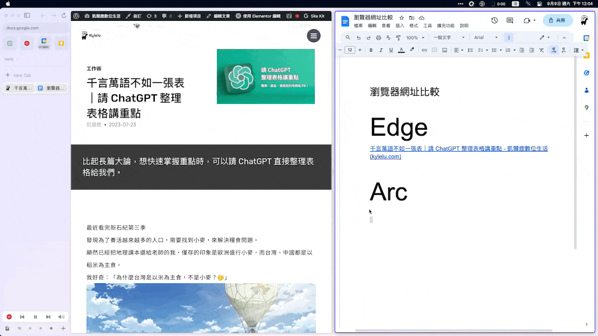
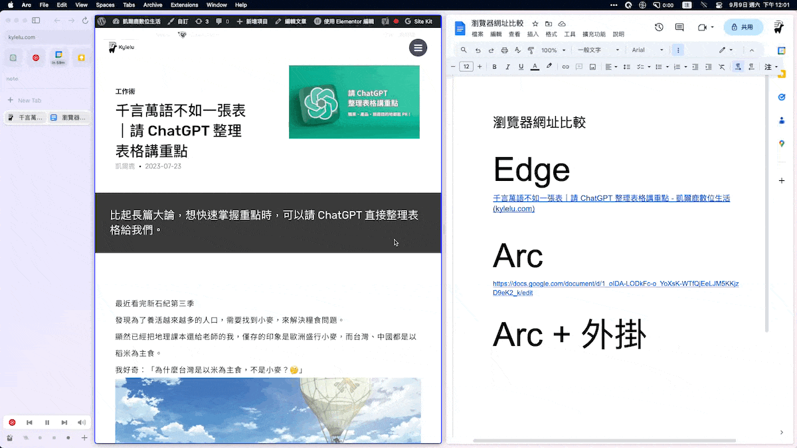

教你如何在 Arc 瀏覽器中透過「Copy as Markdown」擴充外掛，同時複製網頁的標題和網址。
<!--more-->



已經使用了 Arc 瀏覽器 1 個多月，它類似手機 APP 的操作介面真是越用越順手。

從 Space 工作區到分割視窗，再到迷你播放器，都可以感受到它貼心的設計。但從 Edge 轉換到 Arc，有一點小困擾：複製網址時，它就像是買一杯珍奶但忘了加珍珠，不會自動帶入網頁標題?

## 複製網址的小困擾 {.wp-block-heading}

日常工作上，常常會需要複製網址給同事或是自己要紀錄筆記時，如果直接丟一串英文網址會有 3 個顯而易見的缺點：

  1. 很醜很傷眼
  2. 聊天室像被詐騙集團入侵?
  3. 可能會手滑眼殘沒發現貼錯網址

除非真的是要確認「網址本身」的狀態，例如是不是正確的網域、為了特殊目的帶追蹤碼，否則驚喜應該留給生日當天，不是網址！

如果是在 Edge 複製貼上網址，就會直接以網頁標題自動帶入超連結的方式呈現：

*從 Edge 複製貼上網址很直覺*

目前的 Arc 複製貼上網址，就…單純是一串英文網址。

*從 Arc 複製貼上網址就是英文網址*

## 同時複製網址和網頁標題的方法？ {.wp-block-heading}

那有什麼方式可以讓 Arc 跟 Edge 一樣，複製網址 (URL) 就是同時複製網頁標題 (Title) ？

甚至更進一步，使用 Markdown 的語法，可以同時呈現網頁標題文字和網址

> 什麼是 Markdown ?</strong>\ Markdown 是一種輕量級的標記語言，讓你可以用簡單、易讀易寫的純文字格式編寫文件，然後轉換成結構化的 HTML 頁面。換句話說，它讓你專注於內容，而不是外觀。例如使用 <code>#</code> 來表示標題、<code>*</code> 來做為清單的項目符號等等。

使用 Markdown 的好處是相容性很高，你可以直接將文字轉換成Word 檔、 PDF 或者是 html 不用花太多時間在排版上。

## 擴充外掛：Copy as Markdown {.wp-block-heading}

Arc 基於Chromium 開發，基本上 Chrome 能裝的外掛它都 OK！

安裝這款 Chrome 的擴充外掛：「[Copy as Markdown][1]」

*外掛商店頁面*

安裝後 3 個小步驟：

  1. 在網頁旁邊選 3 個點點的選單鈕
  2. 點擊「Copy as Markdown」icon
  3. 選擇 「Current tab link」就可以啦

這個外掛還可以一口氣複製瀏覽器上的所有分頁標題和網址，或是各自獨立開來，非常方便。

希望這篇文章能幫助你讓 Arc 瀏覽器更好用，解決複製貼上網址的小困擾！

 [1]: https://chrome.google.com/webstore/detail/copy-as-markdown/fkeaekngjflipcockcnpobkpbbfbhmdn/related