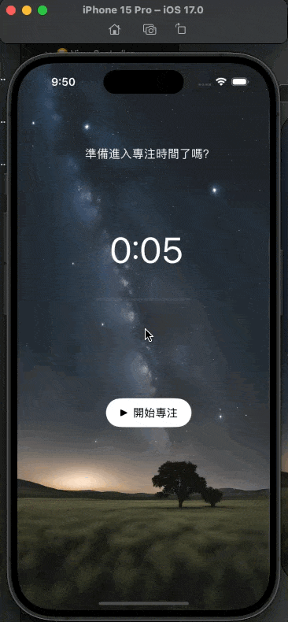

一款簡約的番茄鐘 APP，讓你在令人心曠神怡的專注草原上，每次前進一小步，並在蟲鳴鳥叫聲中小憩片刻。
<!--more-->




## 作品介紹 {.wp-block-heading}

一款簡約的番茄鐘 APP，讓你在令人心曠神怡的專注草原上，每次前進一小步，並在蟲鳴鳥叫聲中小憩片刻。



## 學習目標 {.wp-block-heading}

  1. 倒數計時：Timer
  2. 進度條控制：progressBar
  3. 音檔播放：AVAudioPlayer

<div style="height:30px" aria-hidden="true" class="wp-block-spacer">
</div>

## 練習方向 {.wp-block-heading}

  1. 設計版面 UI 元素
  2. 用 IBOutlet 設計 UI 介面
  3. 加入程式碼
  4. 測試與優化

<div style="height:30px" aria-hidden="true" class="wp-block-spacer">
</div>

## 練習步驟 {.wp-block-heading}

### **Step 1: 建立 UI** {.wp-block-heading}

首先，用 Xcode 的 Storyboard 來設計專注草原。

```swift
@IBOutlet weak var textLabel: UILabel!
@IBOutlet weak var countdownLabel: UILabel!
@IBOutlet weak var progressBar: UIProgressView!
@IBOutlet weak var controlButton: UIButton!
```

### **Step 2: 寫 Swift Code** {.wp-block-heading}

  1. 連接 UI 元件到 ViewController。
  2. 宣告變數。

```swift
var timer: Timer? // 計時器
var secondsRemaining = 5 // 總秒數 25 分鐘 x 60 秒 = 1500 秒，為了方便測試先用 5 秒
let totalSeconds = 5 // 計算進度條的總秒數
var player: AVAudioPlayer!
```

### A. 控制番茄鐘的開始和暫停 {.wp-block-heading}

番茄鐘會有 3 種狀態以及對應的按鈕文字

  1. 全新狀態｜尚未開始：開始專注
  2. 進行狀態｜倒數中：停止
  3. 預設狀態｜倒數完成：重新開始

**尚未開始**

  * 這是當 `timer` 是 nil（番茄鐘沒有啟動）且 `secondsRemaining` 是0（時間還沒開始倒數）的時候。
  * 按鈕文字為：「開始專注」

**倒數中**

  * 當 `timer` 是 nil（番茄鐘沒有啟動）但 `secondsRemaining` 不是0（還有一些時間剩下）時，表示番茄鐘正在倒數，可以隨時暫停。
  * 按鈕文字為：「停止」

**倒數完成**

倒數完成功能是在最後測試優化階段的時候加上的，發現只有開始和停止的話，番茄鐘跑完就跑完了，沒辦法歸零重啟，因此在判斷式最後加上「重新開始」功能。

  * 當 `timer` 不是 nil（番茄鐘有被開啟）的時候，就出現預設文字。
  * 按鈕文字為：「重新開始」

<div style="height:30px" aria-hidden="true" class="wp-block-spacer">
</div>

**ChatGPT 說明關於 for: .normal :**

> 在UIKit中，<code>for: .normal</code> 是用於設定 UIButton 的特定狀態。<br />UIButton 有多種不同的狀態，例如：
  </p>
  
  <ul>
    <li>
      <code>.normal</code>: 按鈕的正常狀態。
    </li>
    <li>
      <code>.highlighted</code>: 按鈕被按下，但還沒放開的狀態。
    </li>
    <li>
      <code>.disabled</code>: 按鈕被禁用的狀態。
    </li>
    <li>
      <code>.selected</code>: 按鈕被選中的狀態。
    </li>
  </ul>

```swift
@IBAction func controlButtonPressed(_ sender: UIButton) {
    if timer == nil { // 檢查 timer 變數如果是 nil，表示計時器目前沒有開始或已被停止。
        if secondsRemaining == 0 {
          // Reset the timer to the default value
            secondsRemaining = totalSeconds
            updateUI()
            controlButton.setTitle("開始專注", for: .normal)
        } else {
            startTimer()
            controlButton.setTitle("停止", for: .normal)
        }
    } else {
        stopTimer()
        controlButton.setTitle("重新開始", for: .normal)
    }
}
```

要設定下方倒數按鈕的 function 需要拖拉按鈕

```swift
@IBAction func controlButtonPressed(_ sender: UIButton) 
```


*點擊 button，從右側Connection Inspector找到Touch Up Inside*

點擊 button 後，在右側形狀像圓圈中帶有右箭頭的 icon &#8220;Connection Inspector&#8221; 找到 &#8220;Touch Up Inside&#8221;，拖拉到 veiewController 這邊<figure class="wp-block-image size-large">


*命名 controlButtonPressed 並且設定 type 為 UIbutton*

<div style="height:30px" aria-hidden="true" class="wp-block-spacer">
</div>

### B. 開始計時 {.wp-block-heading}

用`startTimer()` 函數啟動一個計時器，每秒減少 `secondsRemaining` 的值並更新UI，直到時間完全倒數完畢。

使用 `Timer` 類別的 `scheduledTimer` 方法來建立一個計時器。

這個計時器每一秒 ( `withTimeInterval: 1` ) 就會觸發一次，因為 `repeats` 設定為 `true`。

這裡用判斷式，檢查時間倒數完了沒？

  * 如果還有剩餘時間，那每次計時器觸發，就將 `secondsRemaining` 減 1，代表時間過去了一秒。
  * 倒數過程，呼叫 `updateUI()` 函數來更新 UI 介面，顯示新的剩餘時間並更新進度條。
  * 如果 `secondsRemaining` 不大於 0（時間已經倒數完畢），則標題文字為「時間到！」。

<div style="height:30px" aria-hidden="true" class="wp-block-spacer">
</div>

**ChatGPT 說明關於 self :**

> 在 Swift 中，<code>self</code> 是一個特殊的關鍵字，用於指代當前的實例或物件。使用 <code>self</code> 可以區分屬性或方法與局部變數之間的名稱衝突，並明確指示我們正在存取或修改的是物件的屬性還是方法。
    在您提供的 <code>startTimer()</code> 函數中，我們在閉包 (closure) 或區塊 (block) 內部存取或修改物件的屬性或方法，這時通常需要明確使用 <code>self</code> 來指代當前的實例。


```swift
func startTimer(){
    timer = Timer.scheduledTimer(withTimeInterval: 1, repeats: true, block: { timer in
        if self.secondsRemaining > 0 { //檢查 secondsRemaining 是否大於 0。如果是，代表還有時間尚未倒數完畢。
            self.secondsRemaining -= 1 
            self.updateUI()
        } else {
            self.textLabel.text = "時間到！"
            self.playSound()
            self.stopTimer()
        }
    })
}
```

更新 UI 設定更新 UI 的 function，更新用戶界面，讓它反映目前的倒數時間和進度。 根據目前剩餘的秒數（`secondsRemaining`）來更新倒數標籤的文本和進度條的進度。

<div style="height:30px" aria-hidden="true" class="wp-block-spacer">
</div>

### C. 更新UI {.wp-block-heading}

以下分為兩個部分：`countdownLabel` 和 `progressBar`

將 `countdownLabel` 的文本設定為 MM:SS 的格式，例如 &#8220;02:05&#8243;。

```swift
countdownLabel.text = "\(secondsRemaining / 60):\(String(format: "%02d", secondsRemaining % 60))"
```

  1. `countdownLabel.text`：這裡設定 `countdownLabel`（一個 UILabel）的文本屬性，以顯示倒數時間。
  2. `"\(secondsRemaining / 60)"`：這部分計算剩餘的分鐘數。例如，如果 `secondsRemaining` 是 125，那麼 125 除以 60 等於 2，表示還剩下 2 分鐘。
  3. `"\(String(format: "%02d", secondsRemaining % 60))"`：這部分計算剩餘的秒數，並格式化為兩位數。  
    `%02d` 是一個格式化字符串，表示如果秒數小於 10（例如 9），它會顯示為 09。  
    使用 `%` 取得 `secondsRemaining` 的餘數是為了得到秒數，例如 125 秒 % 60 = 5 秒。

接著是設定 `progressBar` 的 progress 屬性，用 `progressBar.progress` 呈現進度條的完成程度。

```swift
progressBar.progress = 1.0 - Float(secondsRemaining) / Float(totalSeconds)
```

  1. `Float(secondsRemaining) / Float(totalSeconds)`：這部分計算的是已經過去的時間所佔的比例。如果總時間（`totalSeconds`）是 1500 秒，並且還剩下 750 秒（`secondsRemaining`），那這個比例就是 0.5。
  2. `1.0 - ...`：由於我們想要了解倒數的進度，所以我們將 1 減去上述的比例，這樣當時間開始時，進度條會是 0，而當時間結束時，進度條會是 1（或 100%）。

```swift
func updateUI() {
    countdownLabel.text = "\(secondsRemaining / 60):\(String(format: "%02d", secondsRemaining % 60))"
    progressBar.progress = 1.0 - Float(secondsRemaining) / Float(totalSeconds)
}
```

<div style="height:30px" aria-hidden="true" class="wp-block-spacer">
</div>

### D. 停止計時 {.wp-block-heading}

```swift
func stopTimer() {
    timer?.invalidate()
    timer = nil
}
```

<div style="height:30px" aria-hidden="true" class="wp-block-spacer">
</div>

### Step 3: 測試與優化 {.wp-block-heading}

  1. 倒數計時歸零後，應該要可以重新開始計時 可以參考 Step 2
  2. 關於增加聲音，原本一開始是用 ! 強制展開，結果 APP 只要遇到播音檔就閃退

```swift
func playSound() {
    let url = Bundle.main.url(forResource: "nature-soundstropicaljunglebirds", withExtension: "mp3")
    player = try! AVAudioPlayer(contentsOf: url!)
    player.play()
}
```

根據 ChatGPT 的建議，改成以下判斷式之後，才避免閃退，並發現問題在「未找到音檔」！

```swift
func playSound() {
    if let url = Bundle.main.url(forResource: "nature-soundstropicaljunglebirds", withExtension: "mp3") {
        do {
            player = try AVAudioPlayer(contentsOf: url)
            player.play()
        } catch {
            print("音檔播放錯誤: \(error.localizedDescription)")
        }
    } else {
        print("未找到音檔")
    }
}
```


檢查 “Build Phases” ，展開 &#8220;Copy Bundle Resources“，發現沒有 mp3 音檔

才發現原來是我沒有把音檔正確拖曳到專案導覽器（Project Navigator）。

音檔有放進 assets 資料夾，但不是放進跟 viewcontroller 同一層資料夾，因此抓不到。我直接將 mp3 檔拖曳到 viewcontroller 同一層資料夾，問題就解決了！

一拖曳過去，果然就可以正常播放音檔了～


*影片 00:12 處開始播放聲音*

<div style="height:30px" aria-hidden="true" class="wp-block-spacer">
</div>

這次經驗，讓我學習到：

  1. 如果之後遇到 APP 會閃退，那可以將 code 改為可以印出「問題狀況」的形式，觀察問題點在哪裡，再對症下藥。
  2. Timer 和 progressBar 需要考慮不同的倒數狀態、總秒數和剩餘秒數的轉換。
  3. 音檔需要放在跟 ViewController 同一層資料夾。
  4. 對 self 、 UIbutton .normal 的實際應用還需要再了解。

<div style="height:30px" aria-hidden="true" class="wp-block-spacer">
</div>

## 參考資料 {.wp-block-heading}

  * [iOS & Swift – The Complete iOS App Development Bootcamp][1]： Ch 8
  * [Build a count down timer with Swift 3.0 | by Jen Sipila | iOS App Development | Medium][2]
  * [Xcode 排除錯誤訊息][3]
  * Github 作品連結：[kkylelu/Pomodoro-Timer][4]

 [1]: https://www.udemy.com/course/ios-13-app-development-bootcamp/
 [2]: https://medium.com/ios-os-x-development/build-an-stopwatch-with-swift-3-0-c7040818a10f
 [3]: https://medium.com/%E5%BD%BC%E5%BE%97%E6%BD%98%E7%9A%84-swift-ios-app-%E9%96%8B%E7%99%BC%E5%95%8F%E9%A1%8C%E8%A7%A3%E7%AD%94%E9%9B%86/%E5%A6%82%E4%BD%95%E5%B0%87-ios-app-%E4%BD%9C%E6%A5%AD%E4%B8%8A%E5%82%B3%E5%88%B0-github-135416069dfd
 [4]: https://github.com/kkylelu/Pomodoro-Timer